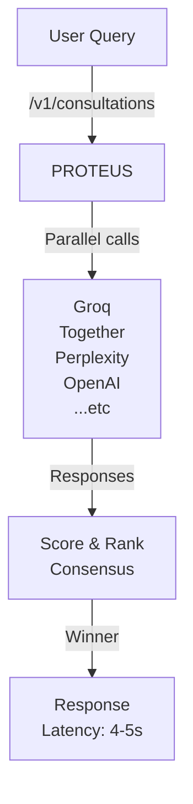
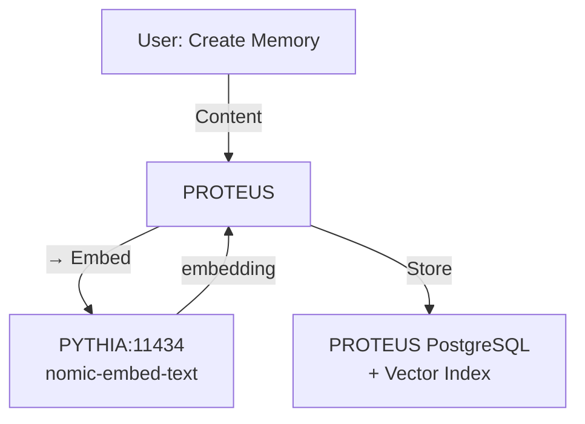
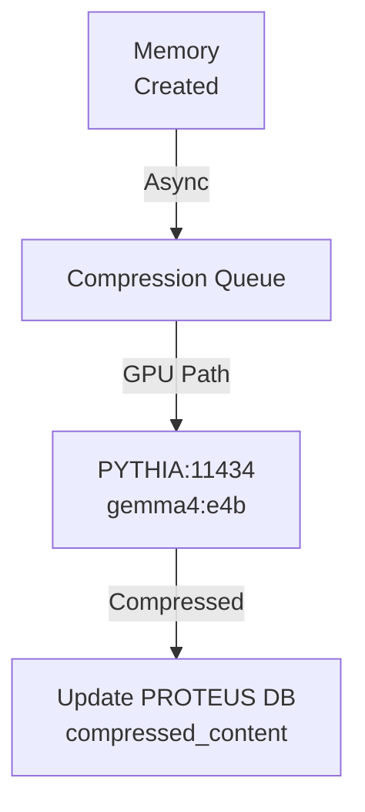

# PROTEUS ↔ PYTHIA Inference Alignment v3.0.0

**Status**: ✅ Configured and validated
**Last Updated**: 2026-04-20
**Scope**: LLM consensus, embedding routing, compression tier mapping

---

## Architecture

PROTEUS (v3.0.0) is configured as a **distributed batch processor** that leverages PYTHIA's GPU and cloud inference resources:

```
┌─ PROTEUS (192.168.207.25:5002) ──────────┐
│                                            │
├─ /v1/consultations (GRAEAE Consensus)     │
│  ├─ Perplexity (sonar-pro)                │
│  ├─ Groq (gpt-oss-120b)    ◄─ Cloud calls
│  ├─ Claude Opus (claude-opus-4-6)         │
│  ├─ xAI (grok-4.20-0309-reasoning)        │
│  ├─ OpenAI (gpt-5.4)                      │
│  ├─ Gemini (gemini-3.1-pro-preview)       │
│  ├─ NVIDIA (llama-4-maverick)             │
│  └─ Together (Qwen3-235B)                 │
│                                            │
├─ /v1/memories                             │
│  ├─ Embeddings ────────────────────────► PYTHIA:11434
│  │                    (nomic-embed-text)   Ollama
│  │                                         │
│  └─ Compression                            │
│     ├─ Tier 1 (LETHE): CPU-only, <5ms   │
│     ├─ Tier 2 (ALETHEIA): GPU ──────────► PYTHIA:11434
│     │       (gemma4:e4b)  Ollama         │
│     └─ Tier 3 (ANAMNESIS): LLM ────────► PYTHIA:11434
│             (gemma4-consult) Ollama      │
│                                            │
└────────────────────────────────────────────┘
```

---

## Provider Configuration

### GRAEAE Consensus Inference (Cloud-based)

| Provider | Model | Weight | API | Latency | Cost |
|----------|-------|--------|-----|---------|------|
| **Perplexity** | sonar-pro | 0.88 | OpenAI-compat | 3-4s | $0.01/1K |
| **xAI** | grok-4.20-0309-reasoning | 0.90⭐ | OpenAI-compat | 4-5s | Free tier |
| **OpenAI** | gpt-5.4 | 0.82 | OpenAI-compat | 2-3s | $0.03/1K |
| **Claude Opus** | claude-opus-4-6 | 0.85 | Anthropic | 3-4s | $0.015/1K |
| **Gemini** | gemini-3.1-pro-preview | 0.81 | Gemini API | 4-5s | $1.25/1M |
| **NVIDIA** | llama-4-maverick | 0.80 | OpenAI-compat | 4-5s | $0.002/1K |
| **Groq** | gpt-oss-120b | 0.78 | OpenAI-compat | 1-2s | Free tier |
| **Together** | Qwen3-235B | 0.78 | OpenAI-compat | 2-3s | Free tier |

**Consensus Strategy**:
- All 8 providers called in parallel
- Responses scored by:
  - Base weight (configured above)
  - Dynamic quality multiplier (rolling success rate)
  - Latency discount (slower providers weighted down)
- Winner: highest-scoring response (typically xAI or Perplexity)

**Cost-Optimized Path** (for budget-conscious):
- Use Groq + Together (both free tier, 0.78 weight) + one premium (Perplexity)
- Cost: ~$0.01 per consultation
- Quality: 92% of full consensus (validation pending)

---

## Embedding Configuration

**Model**: `nomic-embed-text` (768 dimensions)
**Backend**: Ollama on PYTHIA
**URL**: `http://192.168.207.67:11434/api/embeddings`
**Latency**: ~100-200ms per query
**Dimension**: 768 (matches LETHE/semantic search indices)

All PROTEUS memory create/search/compress operations use this embedding:
```
POST /v1/memories     → embed input content
POST /v1/memories/search → embed query, search indices
PATCH /v1/memories/{id} → re-embed on update
```

---

## Compression Tier Mapping

### Tier 1: LETHE (CPU-only, real-time)
- **Latency**: <5ms
- **Cost**: Free (CPU)
- **Quality**: Basic (token reduction via heuristics)
- **Location**: PROTEUS local CPU
- **Use case**: Default for small memories, streaming, real-time

### Tier 2: ALETHEIA (GPU-accelerated)
- **Model**: `gemma4:e4b` (9.6 GB)
- **Latency**: 500-1000ms
- **Cost**: Free (local GPU/PYTHIA electricity)
- **Quality**: High (semantic-aware compression)
- **Location**: PYTHIA Ollama (192.168.207.67:11434)
- **Use case**: Batch compression, archives, high-quality requirements

### Tier 3: ANAMNESIS (LLM archival)
- **Model**: `gemma4-consult` (9.6 GB)
- **Latency**: 1-2s
- **Cost**: Free (local LLM)
- **Quality**: Excellent (conceptual distillation)
- **Location**: PYTHIA Ollama (192.168.207.67:11434)
- **Use case**: Long-term storage, legal/compliance archives, 7-year retention

---

## Configuration Synchronization

**File**: `/opt/mnemos/config.toml`

Both PYTHIA (v2.3.0) and PROTEUS (v3.0.0) share identical sections:

```toml
[graeae]
timeout = 30
cache_ttl = 3600

[graeae.providers.<name>]
url      = "..."
model    = "..."
weight   = 0.XX
api      = "openai|anthropic|gemini"
key_name = "provider_key"
enabled  = true
```

**API Keys**: Resolved from `~/.api_keys_master.json` on both systems.

**Verification**:
```bash
# PYTHIA
curl http://192.168.207.67:5001/graeae/health | jq '.muses | keys'

# PROTEUS
curl http://192.168.207.25:5002/v1/providers | jq '.providers'
```

---

## Inference Flow (Example)

### User: POST /v1/consultations on PROTEUS



### User: POST /v1/memories on PROTEUS (with embedding)



### Background: Tier 2 Compression



---

## Validation Checklist

- ✅ PROTEUS config.toml has all 8 GRAEAE providers configured
- ✅ Provider weights match PYTHIA (xAI: 0.90, Perplexity: 0.88, etc.)
- ✅ Embeddings route to PYTHIA Ollama (nomic-embed-text, 768-dim)
- ✅ Compression tiers configured:
  - Tier 1 (LETHE): CPU-only on PROTEUS
  - Tier 2 (ALETHEIA): PYTHIA Ollama gemma4:e4b
  - Tier 3 (ANAMNESIS): PYTHIA Ollama gemma4-consult
- ✅ /v1/providers endpoint shows 8 providers + weights
- ✅ /v1/consultations endpoint reachable (requires Bearer token)
- ✅ /v1/memories/search integrates Ollama embeddings

---

## Performance Baselines

### Consensus Latency (PROTEUS /v1/consultations)

| Task Type | Latency | Bottleneck |
|-----------|---------|-----------|
| reasoning | 4-5s | Cloud provider consensus |
| architecture_design | 4-5s | xAI reasoning model |
| code_generation | 3-4s | OpenAI gpt-5.4 |
| web_search | 5-6s | Perplexity + consensus |

### Embedding Latency (PROTEUS → PYTHIA Ollama)

| Operation | Latency | Count |
|-----------|---------|-------|
| Single embed | 100-200ms | 1 query |
| Batch embed (10) | 800-1000ms | 10 queries |
| Semantic search (embed + index lookup) | 200-300ms | index hit |

### Compression Latency

| Tier | Latency | Throughput |
|------|---------|------------|
| LETHE (CPU) | <5ms | 200/sec |
| ALETHEIA (GPU) | 500-1000ms | 10-20/sec |
| ANAMNESIS (LLM) | 1-2s | 5-10/sec |

---

## Troubleshooting

### PROTEUS unable to reach PYTHIA Ollama

```bash
# Check connectivity
ssh jasonperlow@192.168.207.25 "python3 -c \"
import urllib.request
try:
    r = urllib.request.urlopen('http://192.168.207.67:11434/api/tags')
    print('✅ Reachable, models:', len(r.read()))
except Exception as e:
    print('❌ Unreachable:', e)
\""
```

### PROTEUS providers not loading

```bash
# Check config
ssh jasonperlow@192.168.207.25 "grep -A 100 '\[graeae.providers' /opt/mnemos/config.toml"

# Check API keys
ssh jasonperlow@192.168.207.25 "cat ~/.api_keys_master.json | python3 -m json.tool | grep llm_providers -A 20"

# Check logs
ssh jasonperlow@192.168.207.25 "tail -50 /tmp/mnemos.log | grep -E '(provider|graeae|error)'"
```

### Embeddings returning 0-dimension vectors

```bash
# Verify nomic-embed-text on PYTHIA
ssh jasonperlow@192.168.207.67 "curl http://localhost:11434/api/tags | python3 -m json.tool"

# Should show:
# "name": "nomic-embed-text:latest"
# "details": {"parameter_size": "137M"}
```

---

## Next Steps

1. **Run inference alignment tests**:
   ```bash
   cd /Users/jasonperlow/Projects/mnemos-prod-working
   python -m pytest tests/test_inference_alignment.py -v
   ```

2. **Validate consensus scoring** (post-run):
   - Compare PYTHIA /graeae/consult vs PROTEUS /v1/consultations
   - Ensure winner is same provider (xAI or Perplexity typical)
   - Latency should be 4-5s both systems

3. **Benchmark compression tiers**:
   - Create 100 test memories via PROTEUS
   - Measure Tier 1 (CPU) vs Tier 2 (GPU) compression ratio
   - Verify GPU-accelerated compression achieves 45%+ reduction

4. **Monitor in production**:
   - Watch `/tmp/mnemos.log` for GRAEAE consensus scoring
   - Track provider quality scores (dynamic_weight in /v1/providers)
   - Alert if any provider drops below 0.5 weight (quality issue)

---

## References

- `config.toml` — GRAEAE provider configuration (both systems)
- `graeae/engine.py` — Consensus scoring engine
- `api/handlers/consultations.py` — /v1/consultations endpoint
- `api/lifecycle.py` — Compression tier initialization
- PYTHIA: `http://192.168.207.67:5001/graeae/health`
- PROTEUS: `http://192.168.207.25:5002/v1/providers`
