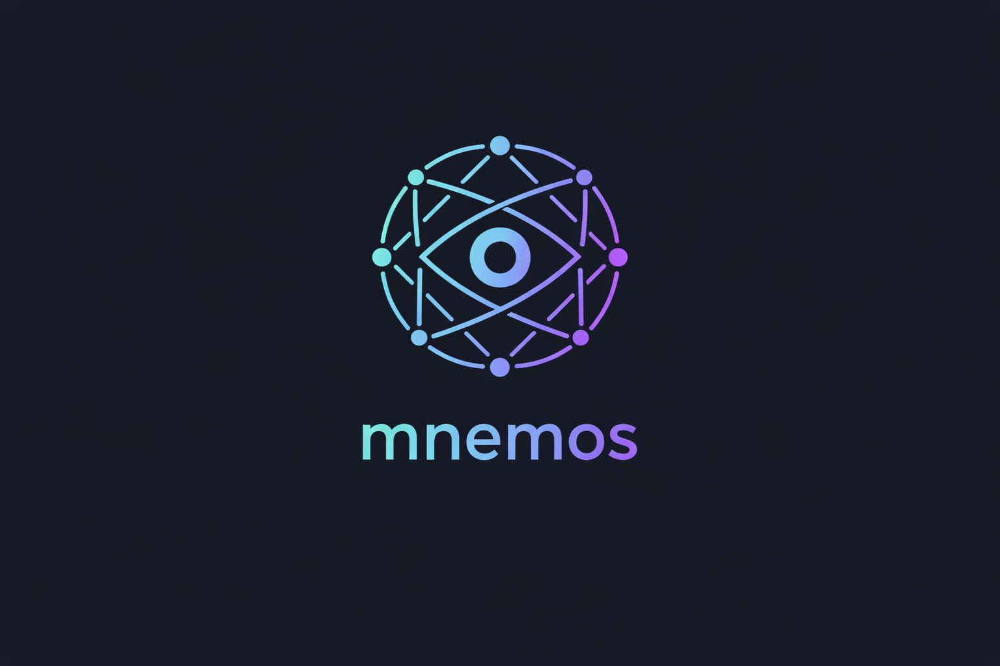

<p align="center">
  
</p>

# MNEMOS + GRAEAE

**Production memory for serious agentic systems.**

MNEMOS is a shared memory service for professional AI and agentic development. It stores, compresses, and reasons over memory with the same operational rigor you would apply to any production database: ACID guarantees, access controls, quality contracts on every transformation, and a cryptographically auditable reasoning layer. It is infrastructure, not a demo feature. It is designed for teams building real systems, where memory has to be persistent, inspectable, attributable, and operationally reliable, not just convenient in a demo.

Deploy MNEMOS once, and every agent in your stack can share the same memory substrate across tools, sessions, and processes. It runs alongside your applications the way Redis, PostgreSQL, or a message bus would, as infrastructure, not as a prompt hack.

This is not an embedded chat-memory helper. It is a network service with a REST API and PostgreSQL backend, designed for multi-agent workflows, provenance-aware memory, compression with quality controls, and optional multi-LLM reasoning via GRAEAE.

---

## Why this exists

MNEMOS was built out of a very practical frustration: serious agentic systems keep losing context at exactly the moment reliability starts to matter.

In most AI tooling, memory is still treated like a convenience feature. A session ends, context evaporates, and the next run has to reconstruct the same decisions, assumptions, architecture tradeoffs, and operating knowledge from scratch. That may be tolerable for hobby projects. It is not good enough for professional users building production systems.

The first version of the problem looked simple. Keep a large context file, inject it into the prompt, and move on. That works until the context becomes expensive, stale, opaque, and impossible to selectively trust. When you compress it, you no longer know exactly what was removed. When multiple agents need it, the whole approach collapses into duplication and drift.

The second version of the problem was operational. Real agentic development means multiple models, multiple providers, failure modes, cost pressure, and different classes of tasks. Memory that cannot survive provider failure, cannot be shared across agents, or cannot explain its own transformations is not really infrastructure.

MNEMOS was built to solve those problems in a way that reflects real platform experience: provenance matters, compression should be inspectable, shared systems need access controls, and memory should behave like a service you can operate, not a feature you hope keeps working.

Its design is informed by years of enterprise platform work, large-vendor systems thinking, open-source infrastructure experience, and current work in the AI industry, without assuming that professional users want marketing language where they really need operational clarity.

The first production commit landed on February 18, 2026. By April 2026 the system had stored **6,793 memories** and performed **3,077 compressions**, each with a quality manifest. It ships today as v3.0.0, backing multiple active agentic tools simultaneously.

---

## Why use this

The field of agent memory systems is crowded and getting more so. Here is the honest case for MNEMOS.

**Most memory systems answer one question badly:** "What did this agent say before?"

That is conversation history. It is useful, but it is not memory infrastructure. Conversation history dies when the session ends, scales to one agent, and tells you nothing about whether the information it contains is still accurate, still complete, or safe to rely on.

MNEMOS answers a different set of questions:

- *When I compressed that memory to fit in a context window, what did I throw away — and was it safe to throw away?*
- *If three of my LLM providers go down, does my reasoning layer fail or degrade gracefully?*
- *Can multiple agents share one memory pool without rebuilding context from scratch each session?*

If none of those questions matter for your use case, a simpler tool is probably the right choice. If they do matter, read on.

### The specific gaps in the alternatives

| System | What it does | What it cannot tell you |
|--------|-------------|------------------------|
| **MemGPT / Letta** | Hierarchical paging within a single agent session | What was lost in compression; what happens when the LLM provider fails |
| **Mem0** | Store and retrieve memories via API | Compression quality; reasoning consensus |
| **Zep** | Conversation history + entity extraction | Compression manifests; multi-provider reasoning |
| **LangChain / LlamaIndex memory** | In-process buffer or summary | Anything after the process exits |
| **MemPalace** | Python wrapper around ChromaDB; 96.6% LongMemEval benchmark is raw verbatim mode — AAAK compression mode regresses to 84.2% | Compression you can trust; multi-user access control; temporal fact resolution; auditable reasoning |
| **CrewAI / AutoGen memory** | Per-crew or per-agent embedded memory | Cross-session persistence; compression quality |

### What MNEMOS does that none of them do

**Quality contracts on compression.** Every time MNEMOS compresses a memory — on write, on rehydration, or before a GRAEAE consultation — it produces a manifest: what was removed, what was preserved, the quality rating, and which use cases the compressed version is and is not safe for. No other memory system treats compression as something that requires a receipt.

**A reasoning layer that degrades gracefully.** GRAEAE distributes queries across multiple LLM providers simultaneously, scores responses on relevance, coherence, completeness, and toxicity, and returns the best result. Per-provider circuit breakers prevent a failing provider from degrading the pool. A semantic cache means identical questions skip inference entirely. This is not a load balancer — it is a quality-gated reasoning bus.

**A knowledge graph alongside free-text memory.** MNEMOS stores structured triples (subject → predicate → object) with temporal validity windows alongside unstructured memories, and exposes a timeline API per subject. Most memory systems are text-only.

---

### Why MemPalace is not the answer

MemPalace gained immediate traction in the OpenClaw and agentic developer community by publishing a **96.6% R@5 score on the LongMemEval benchmark** alongside a local-only, zero-API-cost promise. In an ecosystem where long-term memory without context explosion is actively unsolved, that headline pulled immediate experimental integration from developers who assumed the problem was solved.

The problem is where that score actually came from.

MemPalace's benchmark was measured in **raw verbatim mode** — storing and retrieving unsummarized chat logs in ChromaDB, which is plain vector similarity over raw text. The headline innovations the community adopted — the AAAK abbreviation dialect (claiming 30x lossless compression) and the Palace spatial architecture (claiming improved retrieval through named rooms and wings) — are what developers integrated expecting to get the 96% score. MemPalace's own creators acknowledged on April 7, 2026 that AAAK mode **regresses retrieval accuracy to 84.2%** because abbreviation degrades embedding quality. The spatial architecture is standard ChromaDB metadata filtering.

So the product getting integrated is raw ChromaDB wrapped in Python — with a real-world accuracy in the mid-80s — while developers believe they are getting the 96% version that does not exist in practice. This is a classic case of hype-driven development: the benchmark was real, but it measured a mode nobody uses, and the innovations that drove adoption actively make things worse.

**The architectural gaps, specifically:**

| Capability | MemPalace | MNEMOS |
|---|---|---|
| **Storage** | ChromaDB (SQLite-backed) — known segfault risk on macOS at scale | PostgreSQL + pgvector — ACID transactions, no corruption risk |
| **Multi-user** | Single-process, no access control | Row Level Security, namespace isolation, API key auth |
| **Compression** | AAAK abbreviation dialect — degrades retrieval by 12+ points | Async background distillation via local SLMs (Phi, Llama); quality manifest on every compression |
| **Fact mutation** | Old and new facts coexist in vector space with no resolution mechanism | Temporal KG: triples with `valid_from`/`valid_until`; timeline API per subject |
| **Reasoning audit** | Storage only — no reasoning layer | SHA-256 Merkle-like hash chain on every GRAEAE prompt/response; cryptographically tamper-evident |

MemPalace is a reasonable choice for single-user local development where raw similarity search is sufficient. The moment you need compression you can verify, memory that multiple agents share safely, facts that can be updated without contradiction, or a reasoning layer you can audit, it cannot deliver — those capabilities were never in the design.

MNEMOS took the harder path: PostgreSQL instead of SQLite, real async compression with quality gates and a manifest instead of abbreviation heuristics, and cryptographic audit instead of flat log files. Less flashy to demo, harder to `pip install`, and exactly what production agentic systems actually need.


## What works now

This is the current state of v3.0.0. Features described here are implemented and running in production. Features listed in the Roadmap section that are "scheduled for v3.0.0" are under active development for this release.

The primary API surface is namespaced under `/v1/*`. Pre-v3 endpoints (`/memories`, `/graeae/consult`, `/triples`, etc.) still work as deprecated aliases for backward compatibility but will be removed in a future major version. New integrations should target `/v1/*` exclusively.

### Memory API (v1)

| Endpoint | What it does |
|----------|-------------|
| `POST /v1/memories` | Store a memory with category, subcategory, content, and optional provenance |
| `GET /v1/memories` | List memories, filterable by category and subcategory |
| `GET /v1/memories/{id}` | Retrieve a single memory |
| `POST /v1/memories/search` | Full-text or semantic search with category/score filters |
| `POST /v1/memories/bulk` | Bulk create memories |
| `PATCH /v1/memories/{id}` | Update memory content or metadata |
| `DELETE /v1/memories/{id}` | Delete a memory |
| `POST /v1/memories/rehydrate` | Token-budgeted compressed context load for prompt injection |
| `POST /ingest/session` | Ingest a session transcript |
| `GET /v1/memories/{id}/log` | DAG commit history for a memory |
| `POST /v1/memories/{id}/branch` | Create a branch from a specific commit |
| `POST /v1/memories/{id}/merge` | Merge a branch back to main |
| `GET /v1/memories/{id}/versions` | Version history |
| `GET /health` | Health check (not namespaced) |
| `GET /stats` | Memory counts by category, compression statistics |

### Multi-user and provenance (v1, shipped)

Each memory carries full ownership and LLM provenance:

- `owner_id` — which user owns this memory
- `group_id` — optional group for shared access
- `namespace` — logical partition (e.g. `myapp/analyst`)
- `permission_mode` — UNIX-style octal (600 = owner only, 640 = group readable, 644 = world readable)
- `source_model` — the LLM model that produced this memory
- `source_provider` — the provider (openai, groq, ollama, etc.)
- `source_session` — session ID at time of creation
- `source_agent` — agent name or identifier

**Row Level Security** is defined in PostgreSQL but inactive for personal installs. Team/enterprise installs activate it via `install.py`, which enforces per-row access at the database layer, not application middleware.

**Deployment profiles** — selected at install time via `python install.py`:

| Profile | Auth | RLS | Use case |
|---------|------|-----|---------|
| Personal | off | off | Single developer, localhost |
| Team | API key | on | 2–20 users, shared PostgreSQL |
| Enterprise | API key | on | 20+ users, full namespace isolation |

### Admin API (v1)

| Endpoint | What it does |
|----------|-------------|
| `POST /admin/users` | Create a user |
| `GET /admin/users` | List all users |
| `POST /admin/users/{id}/apikeys` | Generate an API key (raw key returned once) |
| `GET /admin/users/{id}/apikeys` | List API keys for a user |
| `DELETE /admin/apikeys/{id}` | Revoke an API key (soft-delete) |

All admin endpoints require root role. On personal installs (no auth), they are accessible without a key.

### Knowledge graph

| Endpoint | What it does |
|----------|-------------|
| `POST /triples` | Create a subject → predicate → object triple |
| `GET /triples` | List triples with filters |
| `GET /timeline/{subject}` | All triples for a subject in temporal order |
| `PATCH /triples/{id}` | Update a triple |
| `DELETE /triples/{id}` | Delete a triple |

### Consultations — reasoning domain (v3, shipped)

Multi-LLM consensus reasoning with cited memory artifacts and cryptographic audit chain.

| Endpoint | What it does |
|----------|-------------|
| `POST /v1/consultations` | Create a consultation (prompt + task_type) |
| `GET /v1/consultations/{id}` | Retrieve a consultation record |
| `GET /v1/consultations/{id}/artifacts` | Cited memories used to answer |
| `GET /v1/consultations/audit` | Hash-chained audit log |
| `GET /v1/consultations/audit/verify` | Verify audit chain integrity |

Legacy `POST /graeae/consult` remains functional as a deprecated alias.

### Providers — model routing domain (v3, shipped)

Unified provider catalog with health tracking and task-aware recommendation.

| Endpoint | What it does |
|----------|-------------|
| `GET /v1/providers` | List all configured providers with metadata |
| `GET /v1/providers/{provider}` | Inspect a single provider |
| `GET /v1/providers/health` | Per-provider availability + circuit-breaker state |
| `GET /v1/providers/recommend` | Recommend a model for a task-type + budget |
| `GET /v1/providers/best` | Highest-scoring provider right now |

Legacy `/model-registry/*` paths remain functional as deprecated aliases.

### OpenAI-compatible gateway (v3, shipped)

Drop-in replacement for the OpenAI Chat Completions API — so any SDK that speaks OpenAI can speak to MNEMOS.

| Endpoint | What it does |
|----------|-------------|
| `GET /v1/models` | List available models across all configured providers |
| `GET /v1/models/{model_id}` | Model details |
| `POST /v1/chat/completions` | Chat completion; routes to the appropriate provider; optional memory injection |

### Stateful sessions (v3, shipped)

Multi-turn conversation state with memory injection at turn boundaries. Sessions carry accumulated context across requests.

| Endpoint | What it does |
|----------|-------------|
| `POST /v1/sessions` | Start a new session |
| `GET /v1/sessions/{id}` | Retrieve session state |
| `GET /v1/sessions/{id}/history` | Full message history |
| `DELETE /v1/sessions/{id}` | End a session |

### Webhooks (v3, shipped)

Outbound notifications when events happen. Receivers verify an HMAC-SHA256 signature to trust the payload.

| Endpoint | What it does |
|----------|-------------|
| `POST /v1/webhooks` | Subscribe; secret returned once |
| `GET /v1/webhooks` | List the caller's subscriptions |
| `GET /v1/webhooks/{id}` | Retrieve a subscription |
| `DELETE /v1/webhooks/{id}` | Revoke (soft-delete) |
| `GET /v1/webhooks/{id}/deliveries` | Recent delivery attempts |

Events: `memory.created`, `memory.updated`, `memory.deleted`, `consultation.completed`. Delivery is durable: every attempt is logged to `webhook_deliveries`, retried 4 times with exponential backoff (1m / 5m / 30m / 2h), and replayed from disk on restart by the recovery worker.

Signature header: `X-MNEMOS-Signature: sha256=<hex>`. Verify with `hmac.new(secret, body, sha256).hexdigest()`.

### OAuth / OIDC authentication (v3, shipped)

Browser-based login via external identity providers. Coexists with API-key auth — the same user can have both a key and an OIDC identity.

| Endpoint | What it does |
|----------|-------------|
| `GET /auth/oauth/providers` | List enabled providers (public, no secrets) |
| `GET /auth/oauth/{provider}/login` | Start authorization-code + PKCE flow |
| `GET /auth/oauth/{provider}/callback` | Handle provider redirect; sets `mnemos_session` cookie |
| `POST /auth/oauth/logout` | Revoke session (optionally `?all_devices=true`) |
| `GET /auth/oauth/me` | Who am I (works with either auth method) |

Admin side (`/admin/oauth/*` — root only):

| Endpoint | What it does |
|----------|-------------|
| `POST /admin/oauth/providers` | Register a provider (Google, GitHub, Azure AD, or generic OIDC) |
| `GET /admin/oauth/providers` | List configured providers (client_secret redacted) |
| `PATCH /admin/oauth/providers/{name}` | Update provider config |
| `DELETE /admin/oauth/providers/{name}` | Remove a provider |
| `GET /admin/oauth/identities` | List all OAuth identities (optionally filter by user) |

Sessions are DB-backed, revocable, and expire after 30 days by default. User provisioning: same external-id reuses the user; matching email links to an existing user; otherwise a fresh user is created.

### Federation — cross-instance memory sync (v3, shipped)

Pull-based one-way federation between MNEMOS instances. Remote peer exposes `/v1/federation/feed`; local instance pulls on a configurable interval, storing remote memories with ids of the form `fed:{peer_name}:{remote_id}` and `federation_source = peer_name`. Federated memories are read-only by application convention.

| Endpoint | What it does |
|----------|-------------|
| `POST /v1/federation/peers` | Register a remote peer (root only) |
| `GET /v1/federation/peers` | List registered peers |
| `GET /v1/federation/peers/{id}` | Peer detail |
| `PATCH /v1/federation/peers/{id}` | Update (enable/disable, filters, interval) |
| `DELETE /v1/federation/peers/{id}` | Unregister |
| `POST /v1/federation/peers/{id}/sync` | Manual sync trigger (blocks on completion) |
| `GET /v1/federation/peers/{id}/log` | Sync history for a peer |
| `GET /v1/federation/status` | Aggregate status across all peers |
| `GET /v1/federation/feed` | Serve memories to remote peers (role=`federation` or `root`) |

**Trust model:** mutual — each side registers the other. Side A issues Side B a Bearer token by creating a MNEMOS user with `role='federation'` and minting an API key via the admin API. Side B stores that token in its own `federation_peers.auth_token`. Side A's feed endpoint validates the token and `role IN ('federation', 'root')`.

**Dedup:** re-pulls are safe. Local id `fed:{peer}:{remote_id}` is stable; only rows with a newer `federation_remote_updated` overwrite existing ones.

**Filters:** `namespace_filter` and `category_filter` (both arrays) restrict what gets pulled from a peer; NULL = pull everything the peer will serve.

**Loop prevention:** the feed endpoint excludes memories where `federation_source IS NOT NULL`, so federated memories don't propagate hop-by-hop through a chain of peers.

### GRAEAE engine internals (all operational)

The reasoning engine behind `/v1/consultations` provides:

- **Circuit breaker** — per-provider CLOSED/OPEN/HALF_OPEN state machine, 5-minute cooldown
- **Semantic cache** — embedding-similarity deduplication, 1-hour TTL
- **Quality scorer** — success/failure + latency tracking per provider; Arena.ai Elo scores feed dynamic weighting
- **Rate limiter** — single-level request rate limit with graceful backoff
- **Audit chain** — SHA-256 hash-chained prompt/response log for compliance

### Compression — the MOIRAI tiers

Three-tier compression pipeline, each tier named after a Greek figure of memory.

- **LETHE** (Tier 1, CPU, always on) — fast local compression with two modes: `token` (importance-weighted token filtering, ~0.5ms, ~57% reduction — the algorithm formerly called *extractive token filter*) and `sentence` (structure-preserving extraction, ~2–5ms, ~50% reduction — formerly *SENTENCE*). `auto` mode picks per content shape. Zero external calls.
- **ALETHEIA** (Tier 2, optional GPU) — token-level importance scoring via a local LLM on a configured GPU host (`GPU_PROVIDER_HOST`); ~200-500ms, ~70% reduction. Runs offline via distillation worker; not on the live path. Falls back to LETHE when the GPU host is unreachable.
- **ANAMNESIS** (Tier 3, optional GPU) — atomic-fact extraction for archival memories (>30 days old); semantic-level compression via LLM. Fallback: skip extraction if the GPU host is unreachable (non-critical).
- **ExternalInferenceProvider** — LLM-assisted compression via llama.cpp / Ollama / any OpenAI-compatible endpoint; highest quality; used as fallback when heuristics dip below the quality threshold.
- Quality manifest on every compression: what was removed, what was preserved, risk factors, safe/unsafe use cases
- Original content always retained; compressed and original stored independently
- Configurable quality thresholds per task type (security review: 95%, architecture: 90%, general: 80%)

### Memory tiers (4-tier system)

| Tier | Description | Compression ratio |
|------|-------------|------------------|
| 1 | Recent / active | 20% |
| 2 | Short-term | 35% |
| 3 | Medium-term | 50% |
| 4 | Long-term / archive | task-type dependent |

### Versioning and audit (v2, shipped)

- Memory version history (`memory_versions` table) — every mutation auto-snapshots previous state
- Diff and revert API: `GET /memories/{id}/versions`, `GET /memories/{id}/versions/{n}`, `GET /memories/{id}/diff`, `POST /memories/{id}/revert/{n}`
- SHA-256 hash-chained audit log for GRAEAE responses: `GET /graeae/audit`, `GET /graeae/audit/verify`

---

## Roadmap

### Scheduled for v3.0.0 (active development)

Committed to ship with this release:

- ✅ **Webhook subscriptions** — outbound notifications on memory write, consultation completion. HMAC-signed delivery, retry with exponential backoff. **Shipped.**
- ✅ **OAuth/OIDC authentication** — browser-based login via Google, GitHub, Azure AD, or custom OIDC providers. Coexists with existing API-key auth. **Shipped.**
- ✅ **Cross-instance memory federation** — pull-based peer sync with Bearer-authenticated peers. Federated memories stored locally with `federation_source` metadata, `fed:{peer}:{remote_id}` id prefix, and a background worker that respects per-peer sync intervals. **Shipped.**

### Beyond v3.0.0

Future work — not yet scoped:

- Distributed consensus for multi-writer federation
- Plugin model for external compression / ranking algorithms
- Server-push streaming API for long-lived subscriptions

---

## Architecture

```
Agents (any language, any framework)
        │
        │  REST API (port 5002)
        ▼
┌─────────────────────────────────┐
│           MNEMOS API            │
│  auth · namespaces · search     │
│  compression · ingest · admin   │
│  knowledge graph · rehydrate    │
└──────────────┬──────────────────┘
               │
    ┌──────────┴──────────┐
    │                     │
    ▼                     ▼
PostgreSQL           GRAEAE (embedded)
memories             multi-LLM consensus
users / groups       circuit breaker
api_keys             semantic cache
compression_log      quality scorer
knowledge_graph
```

---

## Quick start

### Personal install (Docker Compose)

```bash
git clone <your-repo-url>
cd mnemos
docker compose up
# MNEMOS: http://localhost:5002
# GRAEAE is embedded in the MNEMOS API (port 5002) — no separate server
```

### Manual install

```bash
git clone <your-repo-url>
cd mnemos
pip install -r requirements.txt
python install.py
# Prompts for: deployment profile, database connection, provider API keys
# Writes config.toml, runs migrations, creates root API key (team/enterprise)
```

### Manual database setup (if not using install.py)

```bash
psql -U postgres -c "CREATE USER mnemos WITH PASSWORD 'yourpassword';"
psql -U postgres -c "CREATE DATABASE mnemos OWNER mnemos;"
psql -U mnemos -d mnemos -f db/migrations.sql
psql -U mnemos -d mnemos -f db/migrations_v1_multiuser.sql
psql -U mnemos -d mnemos -f db/migrations_v3_graeae_unified.sql
psql -U mnemos -d mnemos -f db/migrations_v3_webhooks.sql
psql -U mnemos -d mnemos -f db/migrations_v3_oauth.sql
psql -U mnemos -d mnemos -f db/migrations_v3_federation.sql
```

### Start

```bash
python api_server.py        # MNEMOS on port 5002
# GRAEAE is embedded in the MNEMOS API (port 5002) — no separate server needed

curl http://localhost:5002/health
```

---

## API reference

### Store a memory

```bash
# Basic
curl -X POST http://localhost:5002/v1/memories \
  -H 'Content-Type: application/json' \
  -d '{"content": "...", "category": "decisions", "subcategory": "architecture"}'

# With provenance
curl -X POST http://localhost:5002/v1/memories \
  -H 'Content-Type: application/json' \
  -d '{
    "content": "...",
    "category": "decisions",
    "namespace": "myagent/analyst",
    "source_model": "gemma4-consult",
    "source_agent": "background-enricher"
  }'

# Team/enterprise: include API key
curl -X POST http://localhost:5002/v1/memories \
  -H 'Content-Type: application/json' \
  -H 'Authorization: Bearer <your-api-key>' \
  -d '{"content": "...", "category": "decisions"}'
```

### Search

```bash
# Full-text search
curl -X POST http://localhost:5002/v1/memories/search \
  -H 'Content-Type: application/json' \
  -d '{"query": "topic keywords", "limit": 10}'

# Filtered by category
curl -X POST http://localhost:5002/v1/memories/search \
  -H 'Content-Type: application/json' \
  -d '{"query": "keywords", "category": "solutions", "limit": 5}'

# Semantic (vector) search
curl -X POST http://localhost:5002/v1/memories/search \
  -H 'Content-Type: application/json' \
  -d '{"query": "keywords", "semantic": true, "limit": 10}'
```

### Admin: create user and API key

```bash
# Create a user
curl -X POST http://localhost:5002/admin/users \
  -H 'Content-Type: application/json' \
  -d '{"id": "alice", "display_name": "Alice", "role": "user"}'

# Generate API key — raw_key shown once only
curl -X POST http://localhost:5002/admin/users/alice/apikeys \
  -H 'Content-Type: application/json' \
  -d '{"label": "cli-key"}'

# Revoke a key
curl -X DELETE http://localhost:5002/admin/apikeys/<key-id>
```

### GRAEAE reasoning

```bash
curl -X POST http://localhost:5002/v1/consultations \
  -H 'Content-Type: application/json' \
  -d '{"prompt": "Your question", "task_type": "architecture_design"}'

# Extract best result by score
curl -X POST http://localhost:5002/v1/consultations \
  -d '{"prompt": "...", "task_type": "reasoning"}' | \
  jq '.all_responses | to_entries | sort_by(-.[1].final_score)[0]'
```

### Memory categories

| Category | Use for |
|----------|---------|
| `infrastructure` | Configs, endpoints, system state |
| `solutions` | Workarounds, resolved problems |
| `patterns` | Reusable approaches |
| `decisions` | Rationale and tradeoffs |
| `projects` | Per-project context |
| `standards` | Quality gates, conventions |

### GRAEAE task types

| Task type | Notes |
|-----------|-------|
| `architecture_design` | Full consensus |
| `reasoning` | Full consensus |
| `code_generation` | Speed-optimized provider subset |
| `web_search` | Real-time capable providers |

---

## Compression quality manifest

```json
{
  "compression_id": "uuid",
  "quality_rating": 92,
  "what_was_removed": ["2 introductory sentences", "3 supporting examples"],
  "what_was_preserved": ["Complete reasoning chain", "All main conclusions"],
  "risk_factors": ["Missing examples may reduce convincingness"],
  "safe_for": ["Initial consultation", "Quick decision making"],
  "not_safe_for": ["Security-critical decisions", "Detailed technical review"]
}
```

---

## License

MNEMOS is dual-licensed:

- **Apache License 2.0** for the open-source distribution in this repository — see [`LICENSE`](./LICENSE).
- **Proprietary commercial license** available by agreement for organizations that need alternative commercial terms — see [`LICENSE-PROPRIETARY.md`](./LICENSE-PROPRIETARY.md).

Possession of this repository does not automatically grant the proprietary commercial license; contact the maintainer for those terms.
